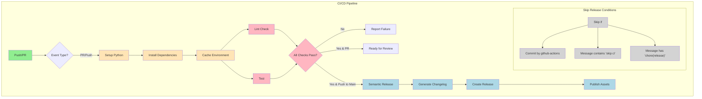

# Contributing to FastAPI CI/CD Template

Thank you for your interest in contributing to our project! This document provides guidelines and workflows for contributing.

## 🔄 Development Workflow

### Prerequisites

1. Python 3.11
2. Poetry (for dependency management)
3. Node.js (for commit linting)
4. Git

### Initial Setup

1. **Fork and Clone**
   ```bash
   git clone https://github.com/YOUR_USERNAME/fast-api-ci-cd.git
   cd fast-api-ci-cd
   ```

2. **Install Dependencies**
   ```bash
   # Install Poetry
   pip install poetry==1.8.5

   # Install project dependencies
   poetry install

   # Install commit linting tools
   npm install
   ```

3. **Set up Pre-commit Hooks**
   ```bash
   poetry run pre-commit install
   poetry run pre-commit install --hook-type commit-msg
   ```

### Code Quality Tools

We use several tools to maintain code quality:

1. **Black** - Code Formatting
   - Line length: 88 characters
   - Python target version: 3.11
   - Run with: `poetry run black .`

2. **Flake8** - Code Style and Quality Checks
   - Configuration in `.flake8`
   - Additional plugins:
     - `flake8-docstrings`: Docstring style checking
     - `flake8-bugbear`: Bug and design problem detection
     - `flake8-comprehensions`: List/dict/set comprehension checks
     - `flake8-simplify`: Code simplification suggestions
   - Run with: `poetry run flake8`

3. **MyPy** - Static Type Checking
   - Configuration in `pyproject.toml`
   - Type stub dependencies included
   - Pydantic plugin enabled
   - Run with: `poetry run mypy`

4. **Pre-commit** - Automated Quality Checks
   - Runs all linters before commit
   - Validates commit messages
   - Run manually: `poetry run pre-commit run --all-files`

### Development Process

1. **Create a Feature Branch**
   ```bash
   git checkout -b feature/your-feature-name
   # or
   git checkout -b fix/your-fix-name
   ```

2. **Make Changes**
   - Write your code following our style guides:
     - Use type hints for function arguments and returns
     - Write docstrings for all public functions/classes
     - Keep docstrings concise and on one line when possible
     - Use descriptive variable names
   - Add tests
   - Update documentation
   - Run local checks:
     ```bash
     # Run all quality checks
     poetry run pre-commit run --all-files

     # Run tests
     poetry run pytest
     ```

3. **Commit Changes**
   We follow the [Conventional Commits](https://www.conventionalcommits.org/) specification:

   ```bash
   # Format
   <type>(<scope>): <description>

   [optional body]

   [optional footer]
   ```

   Types:
   - `feat`: New feature (minor version)
   - `fix`: Bug fix (patch version)
   - `docs`: Documentation only
   - `style`: Code style changes
   - `refactor`: Code refactoring
   - `perf`: Performance improvements
   - `test`: Adding/updating tests
   - `chore`: Maintenance tasks

   Examples:
   ```bash
   feat(api): add new endpoint for user profiles
   fix(auth): resolve token expiration issue
   docs(readme): update installation instructions
   ```

4. **Push Changes**
   ```bash
   git push origin feature/your-feature-name
   ```

5. **Create Pull Request**
   - Go to GitHub and create a PR against the `main` branch
   - Fill out the PR template
   - Link related issues
   - Wait for CI checks to pass

## 🔍 CI/CD Pipeline

Our CI/CD pipeline automates testing, linting, and release processes. Here's a visual representation of our workflow:



### Workflow Details

1. **CI Pipeline** (`ci.yml`)
   - Orchestrates the entire CI/CD process
   - Triggers on pull requests and pushes to main branch
   - Coordinates setup, lint, test, and release jobs
   - Handles release automation when all checks pass on main branch
   - Uses semantic versioning for releases

2. **Setup Environment** (`setup-python.yml`)
   - Sets up Python 3.11 environment
   - Installs and configures Poetry
   - Installs project dependencies
   - Creates and caches virtual environment
   - Produces a reusable artifact for other workflows

3. **Lint Check** (`lint.yml`)
   - Downloads virtual environment artifact
   - Runs Black code formatter in check mode
   - Validates commit messages using commitlint
   - Ensures code style consistency
   - Requires GitHub token for PR access

4. **Test Suite** (`test.yml`)
   - Downloads virtual environment artifact
   - Executes pytest test suite
   - Generates code coverage report
   - Reports test results
   - Writes test results to GitHub Checks

5. **Release Process** (part of `ci.yml`)
   - Only runs on main branch after successful checks
   - Uses Python Semantic Release
   - Creates new version based on commit messages
   - Updates CHANGELOG.md
   - Creates GitHub release with assets

## 📝 Code Style Guidelines

1. **Python Code**
   - Follow PEP 8 guidelines
   - Use Black for formatting
   - Include docstrings for public functions/classes
   - Maximum line length: 88 characters (Black default)

2. **Commit Messages**
   - Follow Conventional Commits format
   - Keep first line under 72 characters
   - Use imperative mood ("add" not "added")
   - Reference issues when relevant

3. **Documentation**
   - Keep documentation up to date
   - Use clear, concise language
   - Include code examples when relevant
   - Update CHANGELOG.md for significant changes

## 🐛 Bug Reports

When filing a bug report, please include:

1. Python version
2. Operating system
3. Steps to reproduce
4. Expected vs actual behavior
5. Relevant logs/screenshots
6. Possible fixes (if any)

## 🚀 Feature Requests

When proposing new features:

1. Explain the problem you're solving
2. Describe the proposed solution
3. Discuss alternatives considered
4. Consider backward compatibility
5. Include implementation details if possible

## 📚 Additional Resources

- [FastAPI Documentation](https://fastapi.tiangolo.com/)
- [Poetry Documentation](https://python-poetry.org/docs/)
- [Conventional Commits](https://www.conventionalcommits.org/)
- [Keep a Changelog](https://keepachangelog.com/)

## ⚖️ License

By contributing, you agree that your contributions will be licensed under the MIT License.

### Testing Process

1. **Unit Tests**
   - API endpoint tests
   - Database integration tests
   - In-memory SQLite for test isolation
   ```bash
   poetry run pytest
   ```

2. **Test Coverage**
   - User registration tests:
     - Successful registration
     - Duplicate email handling
     - Password validation
     - Email format validation
   - QR code generation tests
   - Health check endpoint tests

3. **Database Testing**
   - Tests use in-memory SQLite
   - Each test gets fresh database
   - Automatic cleanup after tests
   - Transaction rollback support

4. **API Testing**
   - FastAPI TestClient for endpoint testing
   - Request validation testing
   - Response schema validation
   - Error handling verification

### Database Workflow

1. **Development Database**
   ```bash
   # SQLite database is created automatically at:
   ./test.db
   ```

2. **Test Database**
   ```bash
   # In-memory SQLite is used for tests
   # No setup required - handled automatically by pytest
   ```

3. **Database Migrations**
   - Models defined in `app/models/`
   - Tables created automatically on startup
   - Development uses SQLite
   - Production should use PostgreSQL

4. **Best Practices**
   - Use SQLAlchemy 2.0 style
   - Follow model-per-file pattern
   - Include proper indexes
   - Add type hints for models
   - Document model relationships
