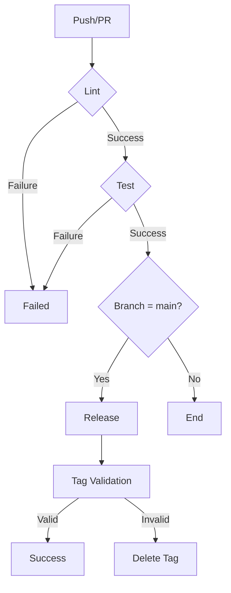

# FastAPI CI/CD Template

[](https://github.com/gsinghjay/fast-api-ci-cd/actions/workflows/ci-cd.yml)
[](https://github.com/gsinghjay/fast-api-ci-cd/releases)
[](https://www.python.org/downloads/)
[](https://codecov.io/gh/gsinghjay/fast-api-ci-cd)
[](https://opensource.org/licenses/MIT)

A production-ready FastAPI template with robust CI/CD pipeline, semantic versioning, and best practices.

## 📑 Table of Contents

- [Features](#-features)
- [Prerequisites](#-prerequisites)
- [Quick Start](#-quick-start)
- [Development Guide](#️-development-guide)
- [Metrics and Monitoring](#-metrics-and-monitoring)
- [Environment Variables](#-environment-variables)
- [License](#-license)
- [Contributing](#-contributing)
- [Security](#-security)
- [Docker Support](#-docker-support)
- [API Documentation](#-api-documentation)
- [Performance](#-performance)
- [Testing](#-testing)
- [Error Handling](#-error-handling)

## 🌟 Features

- FastAPI-based RESTful API
- Poetry for dependency management
- Comprehensive CI/CD pipeline with GitHub Actions
- Semantic versioning and automated releases
- Automated changelog generation
- Code quality checks (Black, Commitlint)
- Test coverage reporting
- Prometheus metrics integration
- Structured logging with structlog

## 📋 Prerequisites

- Python 3.9 or higher
- Poetry (Python package manager)
- Git
- Node.js 18+ (for commitlint)

## 🚀 Quick Start

1. **Use this template**
   ```bash
   # Clone the repository
   git clone https://github.com/yourusername/fast-api-ci-cd
   cd fast-api-ci-cd
   ```

2. **Install dependencies**
   ```bash
   # Install Poetry
   curl -sSL https://install.python-poetry.org | python3 -

   # Install project dependencies
   poetry install

   # Install commitlint
   npm install -g @commitlint/cli @commitlint/config-conventional

   # Install semantic-release
   pip install python-semantic-release==9.15.0
   ```

3. **Set up pre-commit hooks**
   ```bash
   # Install pre-commit hooks
   poetry run pre-commit install
   poetry run pre-commit install --hook-type commit-msg
   ```

4. **Run the application**
   ```bash
   # Development server
   poetry run uvicorn app.main:app --reload

   # Production server
   poetry run uvicorn app.main:app --host 0.0.0.0 --port 8000
   ```

## 🛠️ Development Guide

### Project Structure
```
fast-api-ci-cd/
├── .github/
│   └── workflows/           # CI/CD workflow definitions
├── app/
│   ├── __init__.py         # Version and app initialization
│   └── main.py             # Main FastAPI application
├── tests/                   # Test directory
├── .gitignore              # Git ignore rules
├── CHANGELOG.md            # Automated changelog
├── commitlint.config.js    # Commit message rules
├── poetry.lock            # Lock file for dependencies
├── pyproject.toml         # Project configuration
└── README.md              # This file
```

### Versioning System

This project uses semantic versioning (SemVer) with automated version management through python-semantic-release:

1. **Version Format**: `MAJOR.MINOR.PATCH` (e.g., 1.0.0)
2. **Version Bumps**:
   - `MAJOR`: Breaking changes (feat! or BREAKING CHANGE)
   - `MINOR`: New features (feat)
   - `PATCH`: Bug fixes (fix), performance improvements (perf), or refactoring (refactor)

### Release Commands

The project uses python-semantic-release for version management:

```bash
# Check current version
semantic-release print-version --current

# Preview next version
semantic-release print-version --next

# Update version files
semantic-release version

# Generate changelog
semantic-release changelog

# Create GitHub release
semantic-release publish
```

### Commit Convention

We use Conventional Commits to automate versioning and changelog generation:

```
<type>(<scope>): <description>

[optional body]

[optional footer]
```

**Types**:
- `feat`: New feature (minor version bump)
- `fix`: Bug fix (patch version bump)
- `perf`: Performance improvement (patch version bump)
- `refactor`: Code refactoring (patch version bump)
- `docs`: Documentation changes
- `style`: Code style changes
- `test`: Adding/updating tests
- `chore`: Maintenance tasks

**Examples**:
```bash
# Feature (minor version bump)
git commit -m "feat(auth): add JWT authentication"

# Bug fix (patch version bump)
git commit -m "fix(api): handle null response in user service"

# Breaking change (major version bump)
git commit -m "feat(api)!: change authentication endpoint structure"
```

### CI/CD Pipeline

Our CI/CD pipeline consists of four main stages:



1. **Lint Stage**:
   - Black code formatting
   - Commitlint message validation
   - Pre-commit hook checks

2. **Test Stage**:
   - Runs pytest with coverage
   - Generates coverage report
   - Updates changelog

3. **Release Stage** (main branch only):
   - Uses semantic-release for versioning
   - Generates changelog automatically
   - Creates GitHub release
   - Pushes git tag
   - Supports manual workflow triggers with:
     - Prerelease versions (alpha, beta, etc.)
     - Force version bumps (patch, minor, major)
     - Build metadata
     - Commit signing with SSH keys

4. **Tag Validation**:
   - Verifies tag authenticity
   - Ensures proper versioning

### Manual Release Workflow

You can trigger manual releases with specific configurations through GitHub Actions:

1. **Navigate** to Actions → CI/CD Pipeline → Run workflow
2. **Configure** release options:
   - `prerelease`: Create a prerelease version (true/false)
   - `prerelease_token`: Token for prerelease (e.g., 'alpha', 'beta')
   - `force`: Force version bump ('patch', 'minor', 'major')
   - `build_metadata`: Additional build metadata to append

### Pre-release Patterns

The pipeline supports both manual and automated pre-releases:

1. **Automated Pre-releases**:
   - `develop` branch → `beta` releases (e.g., v1.2.3-beta.1)
   - `release/*` branches → `rc` releases (e.g., v1.2.3-rc.1)
   - Feature branches → Manual alpha releases

2. **Manual Pre-releases**:
   You can create custom pre-releases using workflow dispatch:
   ```bash
   # Beta release
   prerelease: true
   prerelease_token: beta

   # Release candidate
   prerelease: true
   prerelease_token: rc

   # Alpha release with build metadata
   prerelease: true
   prerelease_token: alpha
   build_metadata: "20240101"
   ```

3. **Version Patterns**:
   - Regular releases: `v1.2.3`
   - Beta releases: `v1.2.3-beta.1`
   - Release candidates: `v1.2.3-rc.1`
   - Alpha releases: `v1.2.3-alpha.1`
   - With metadata: `v1.2.3-beta.1+20240101`

### Changelog Generation

The changelog is automatically generated by semantic-release and follows the Keep a Changelog format:

1. **Sections**:
   - Features
   - Bug Fixes
   - Breaking Changes
   - Documentation
   - Performance
   - Refactoring

2. **Generation Rules**:
   - Release commits are excluded
   - [skip ci] commits are excluded
   - Changelog updates are excluded

3. **Configuration**:
   The changelog format is configured in `pyproject.toml`:
   ```toml
   [tool.python_semantic_release]
   changelog_sections = [
       "feature",
       "fix",
       "breaking",
       "documentation",
       "performance",
       "refactor"
   ]
   changelog_components = [
       "semantic_release.changelog.changelog_headers",
       "semantic_release.changelog.compare_url",
       "semantic_release.changelog.commit_list"
   ]
   ```

## 📊 Metrics and Monitoring

The application includes Prometheus metrics at `/metrics` endpoint for monitoring:
- Request counts
- Response times
- Error rates
- System metrics

## 🔒 Environment Variables

Required environment variables:
- `GH_TOKEN`: GitHub token for releases (CI/CD)

## 📝 License

This project is licensed under the MIT License - see the LICENSE file for details.

## 🤝 Contributing

1. Fork the repository
2. Create your feature branch (`git checkout -b feature/amazing-feature`)
3. Make your changes
4. Commit using conventional commits (`git commit -m "feat: add amazing feature"`)
5. Push to the branch (`git push origin feature/amazing-feature`)
6. Open a Pull Request

## 🔐 Security

- All endpoints are rate-limited
- Input validation using Pydantic models
- CORS middleware configured
- Structured logging for audit trails

## 🐳 Docker Support

```bash
# Build the image
docker build -t qr-code-api .

# Run the container
docker run -p 8000:8000 qr-code-api
```

## 📚 API Documentation

Once running, access the interactive API documentation at:
- Swagger UI: `http://localhost:8000/docs`
- ReDoc: `http://localhost:8000/redoc`

## ⚡ Performance

- Async endpoint handling
- Connection pooling
- Response caching
- Optimized QR code generation

## 🧪 Testing

```bash
# Run tests with coverage
poetry run pytest --cov=app tests/

# Generate coverage report
poetry run coverage html
```

## 🚨 Error Handling

The API implements standardized error responses:
- 400: Bad Request - Invalid input
- 404: Not Found - Resource doesn't exist
- 429: Too Many Requests - Rate limit exceeded
- 500: Internal Server Error - Server-side issues
