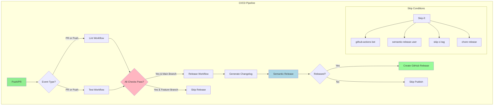

# FastAPI CI/CD Template

[](https://github.com/gsinghjay/fast-api-ci-cd/actions/workflows/release.yml)
[](https://github.com/gsinghjay/fast-api-ci-cd/releases)
[](https://www.python.org/downloads/)
[](https://opensource.org/licenses/MIT)

A production-ready FastAPI template with robust CI/CD pipeline, semantic versioning, and best practices.

## 📑 Features

- FastAPI-based RESTful API with QR code generation
- Poetry for dependency management
- Comprehensive CI/CD pipeline with GitHub Actions
- Semantic versioning with automated releases
- Automated changelog generation on main branch
- Code quality checks (Black, Commitlint)
- Structured logging with structlog
- Prometheus metrics integration
- Conventional Commits standard
- Pull Request based workflow
- Release automation on main branch

## 🔄 Workflow Guide

### Development Workflow

1. **Create a Feature Branch**
   ```bash
   git checkout -b feature/your-feature  # or fix/your-fix
   ```

2. **Make Changes and Commit**
   ```bash
   # Stage changes
   git add .

   # Commit with conventional commit message
   git commit -m "feat(scope): add amazing feature"
   # or
   git commit -m "fix(scope): resolve specific issue"
   ```

3. **Create Pull Request**
   ```bash
   git push origin feature/your-feature
   # Create PR to main branch via GitHub UI
   ```

4. **Release Process**
   - Merging to main branch automatically:
     - Updates CHANGELOG.md
     - Creates a new release
     - Updates version numbers
     - Creates GitHub release with assets

### Commit Message Format

Follow the Conventional Commits standard:

```bash
type(scope): description

[optional body]

[optional footer]
```

Types:
- feat: New feature
- fix: Bug fix
- docs: Documentation changes
- style: Code style changes
- refactor: Code refactoring
- perf: Performance improvements
- test: Adding/updating tests
- chore: Maintenance tasks

## 🛠️ Development Setup

1. **Install Dependencies**
   ```bash
   # Install Poetry
   curl -sSL https://install.python-poetry.org | python3 -

   # Install project dependencies
   poetry install

   # Install commitlint
   npm install -g @commitlint/cli @commitlint/config-conventional
   ```

2. **Set up Pre-commit Hooks**
   ```bash
   poetry run pre-commit install
   poetry run pre-commit install --hook-type commit-msg
   ```

3. **Configure GitHub Token**
   ```bash
   # Add to your environment
   export GH_TOKEN=your_github_pat_token
   ```

## 🚀 Running the Application

```bash
# Development server
poetry run uvicorn app.main:app --reload --log-level debug

# Production server
poetry run uvicorn app.main:app --host 0.0.0.0 --port 8000 --workers 4
```

## 📝 API Documentation

### Generate QR Code
```bash
curl -X POST "http://localhost:8000/api/v1/qr-code/generate" \
     -H "Content-Type: application/json" \
     -d '{
       "url": "https://example.com",
       "fill_color": "#000000",
       "background_color": "#FFFFFF",
       "box_size": 10,
       "border": 4
     }'
```

## 🔍 Environment Variables

Required environment variables:
- `GH_TOKEN`: GitHub token for releases
- `LOG_LEVEL`: Logging level (debug/info/warning/error)
- `PORT`: Application port (default: 8000)
- `WORKERS`: Number of worker processes (default: 1)
- `METRICS_ENABLED`: Enable/disable Prometheus metrics

## 🤝 Contributing

1. Fork the repository
2. Create your feature branch
3. Make changes following our commit conventions
4. Create a Pull Request to main branch
5. Ensure CI checks pass
6. Wait for review and merge

## 📚 Documentation

For more detailed documentation, see:
- [CHANGELOG.md](CHANGELOG.md) for version history
- [API Documentation](http://localhost:8000/docs) when running locally
- [GitHub Actions Workflows](.github/workflows) for CI/CD details

## 🔧 Setup Instructions

### Using This Template

1. **Create New Repository**
   - Click "Use this template" on GitHub
   - Or clone and reinitialize:
     ```bash
     git clone https://github.com/gsinghjay/fast-api-ci-cd
     cd fast-api-ci-cd
     rm -rf .git
     git init
     ```

2. **Configure GitHub Repository**
   - Go to repository Settings → Secrets and Variables → Actions
   - Add `PAT_TOKEN` secret:
     - Generate token at GitHub → Settings → Developer settings → Personal access tokens
     - Required scopes: `repo`, `write:packages`
   - Configure branch protection rules:
     - Settings → Branches → Add rule
     - Protect `main` branch
     - Require pull request reviews
     - Require status checks to pass

3. **Update Configuration Files**
   - Update `pyproject.toml`:
     ```toml
     [tool.poetry]
     name = "your-project-name"
     version = "1.0.0"
     authors = ["Your Name <your.email@example.com>"]
     ```
   - Update GitHub workflow files in `.github/workflows/`
   - Update repository URLs in documentation

### Workflow Debugging Commands

```bash
# List recent workflow runs
gh run list --limit 5

# Watch a specific workflow run
gh run watch

# View workflow run details
gh run view --log

# List failed workflow runs
gh run list --status failed

# Download workflow artifacts
gh run download <run-id>

# View workflow in browser
gh run view --web
```

### Common Issues & Solutions

1. **Release Creation Fails**
   - Check PAT_TOKEN permissions
   - Ensure commit messages follow convention
   - Verify branch protection settings
   - Check git configuration:
     ```bash
     git config --list
     gh auth status
     ```

2. **Changelog Not Updating**
   - Only updates on main branch merges
   - Verify commit message format
   - Check workflow logs for errors
   - Ensure PAT_TOKEN has write permissions

3. **Pre-commit Hooks Failing**
   - Update hooks:
     ```bash
     pre-commit clean
     pre-commit autoupdate
     ```
   - Check commit message format
   - Run black manually:
     ```bash
     poetry run black .
     ```

4. **Workflow Permission Issues**
   - Repository Settings → Actions → General
   - Enable "Allow GitHub Actions to create and approve pull requests"
   - Ensure PAT_TOKEN has required scopes
   - Check workflow permissions in yml files

## 🔄 Semantic Versioning

This project follows [Semantic Versioning 2.0.0](https://semver.org/) principles. Version numbers are structured as MAJOR.MINOR.PATCH:

1. **MAJOR** version - Incremented for incompatible API changes
2. **MINOR** version - Incremented for backward-compatible new functionality
3. **PATCH** version - Incremented for backward-compatible bug fixes

Additional labels for pre-release and build metadata are available as extensions to the MAJOR.MINOR.PATCH format.

### Version Bumping Rules

- Breaking changes (MAJOR): `BREAKING CHANGE:` in commit footer or `!` after type/scope
- New features (MINOR): `feat:` commit type
- Bug fixes (PATCH): `fix:` commit type
- No version bump: `chore:`, `docs:`, `style:`, `refactor:`, `perf:`, `test:`

## 🚀 Python Semantic Release

We use [Python Semantic Release](https://python-semantic-release.readthedocs.io/en/latest/) for automated versioning and changelog generation. Key features:

- Automatic version bumping based on commit messages
- Changelog generation following Keep a Changelog format
- GitHub release creation and asset publishing
- Support for pre-releases and build metadata

### Configuration

Configuration in `pyproject.toml` integrates our versioning and changelog standards:

```toml
[tool.python_semantic_release]
# Version Management
version_variables = ["app/__init__.py:__version__"]  # Update version in code
version_toml = ["pyproject.toml:tool.poetry.version"]  # Update version in pyproject.toml
version_source = ["tag", "commit"]  # Determine version from tags and commits
major_on_zero = false  # Follow SemVer for 0.x versions
tag_format = "v{version}"  # Git tag format (e.g., v1.0.0)

# Commit Parsing
commit_parser = "conventional_commits"  # Use Conventional Commits standard
commit_author = "github-actions[bot] <41898282+github-actions[bot]@users.noreply.github.com>"

# Changelog Management
changelog_file = "CHANGELOG.md"  # Keep a Changelog file
changelog_sections = [  # Keep a Changelog categories
    "feature",    # Maps to Added
    "fix",        # Maps to Fixed
    "breaking",   # Maps to Changed with breaking changes
    "documentation",
    "performance",
    "refactor"
]

# Changelog Behavior
include_unreleased = true  # Track upcoming changes
always_update = true      # Update changelog even without version bump
render_commit_links = true  # Add links to commits
render_title = true        # Include version headers

# Release Settings
upload_to_repository = false
build_command = "poetry build"
tag_type = "annotated"  # Use annotated tags for better documentation
```

### Automatic Standards Compliance

1. **Semantic Versioning**:
   - Analyzes commit messages using Conventional Commits
   - Automatically determines version bumps:
     - `BREAKING CHANGE` → MAJOR
     - `feat:` → MINOR
     - `fix:` → PATCH
   - Creates appropriate Git tags

2. **Keep a Changelog**:
   - Maintains CHANGELOG.md in the standard format
   - Groups changes by type (Added, Changed, Fixed, etc.)
   - Includes release dates and version links
   - Keeps an Unreleased section for upcoming changes
   - Links to Git comparisons between versions
   - Updates changelog even for non-version-bumping changes
   - Tracks all commits in the Unreleased section
   - Provides complete history of all changes

### Manual Release Commands

```bash
# Check what the next version would be
poetry run semantic-release version --noop

# Create a new version (local only)
poetry run semantic-release version

# Create and publish a new release
poetry run semantic-release publish
```

### Environment Setup

Required environment variables:
- `GH_TOKEN`: GitHub Personal Access Token with `repo` scope
- For fine-grained tokens: `contents` permission required

## 🔄 Changelog Guidelines

We follow the [Keep a Changelog](https://keepachangelog.com/en/1.1.0/) principles for maintaining our CHANGELOG.md. This ensures our changelog is:

### Guiding Principles

- Written for humans, not machines
- Easy to link to any section
- One sub-section per version
- List releases in reverse-chronological order
- Include release date for each version
- Group changes by type
- Mention whether we follow Semantic Versioning

### Types of Changes

- `Added` - New features
- `Changed` - Changes in existing functionality
- `Deprecated` - Soon-to-be removed features
- `Removed` - Now removed features
- `Fixed` - Any bug fixes
- `Security` - In case of vulnerabilities

### Good Practices

- Keep an `Unreleased` section at the top for tracking upcoming changes
- Never use commit log diffs as changelog entries
- Always write clear, human-friendly descriptions
- Use ISO 8601 format for dates (YYYY-MM-DD)
- Make it clear when breaking changes occur
- Keep entries consistent and well-organized
- Link to issues, PRs, and other relevant information

### Automatic Updates

The changelog is automatically updated:
- On merges to the main branch
- Even when changes don't trigger a version bump
- For all types of changes (features, fixes, docs, etc.)
- With links to commits and PRs
- In the "Unreleased" section until a new version is released

Development branches (feature/*, fix/*, develop) don't trigger changelog updates. Changes are collected and added to CHANGELOG.md when merged to main.

### Example Entry

```markdown
## [1.0.0] - 2024-01-02

### Added
- New API endpoint for QR code generation
- Support for custom QR code colors

### Changed
- Improved error handling in API responses
- Updated dependencies to latest versions

### Fixed
- Issue with QR code size calculation
- Memory leak in image processing

[1.0.0]: https://github.com/username/project/compare/v0.9.0...v1.0.0
```

## 🔄 Workflow Architecture



### Workflow Files Structure

1. **Lint Workflow** (.github/workflows/lint.yml)
   - Runs Black code formatter
   - Validates commit messages with Commitlint
   - Uses Poetry for dependency management
   - Skips on automated commits and releases

2. **Test Workflow** (.github/workflows/test.yml)
   - Runs pytest with coverage
   - Uses Poetry for dependency management
   - Matrix testing with Python 3.11
   - Skips on automated commits

3. **Release Workflow** (.github/workflows/release.yml)
   - Triggers on main branch pushes
   - Generates changelog
   - Creates semantic releases
   - Publishes GitHub releases
   - Uses Poetry for consistent dependency management
   - Includes manual dispatch options for:
     - Prereleases
     - Force version bumps
     - Custom prerelease tokens
   - Skips when commit is from:
     - github-actions[bot]
     - semantic-release user
     - Contains [skip ci] tag

### Workflow Execution

1. **On Pull Request:**
   - Lint and Test workflows run
   - Release workflow is skipped
   - All checks must pass for merge

2. **On Push to Main:**
   - Full pipeline executes
   - Changelog is updated
   - New release is created if needed
   - Release is published to GitHub

3. **Manual Dispatch:**
   - Available for release workflow
   - Supports prerelease creation
   - Allows force version bumps

### Skip Conditions

Workflows are skipped when:
- Commit is from:
  - github-actions[bot]
  - semantic-release user
- Commit message contains:
  - [skip ci]
  - chore(release)
- Changes are automated release updates
